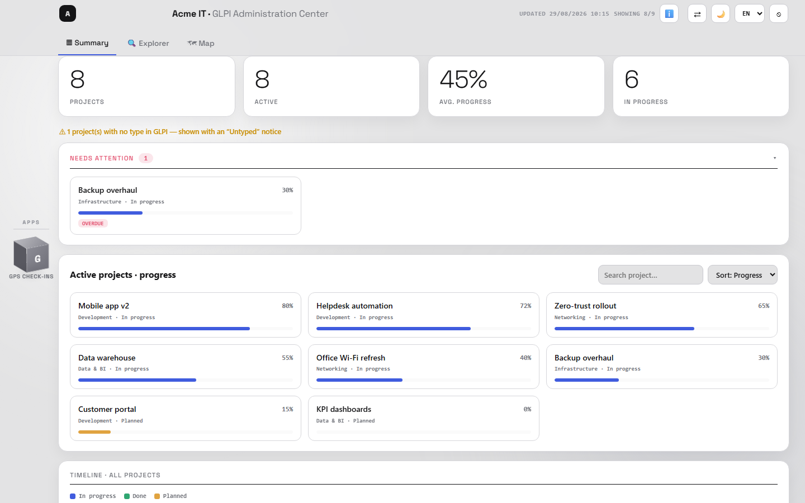
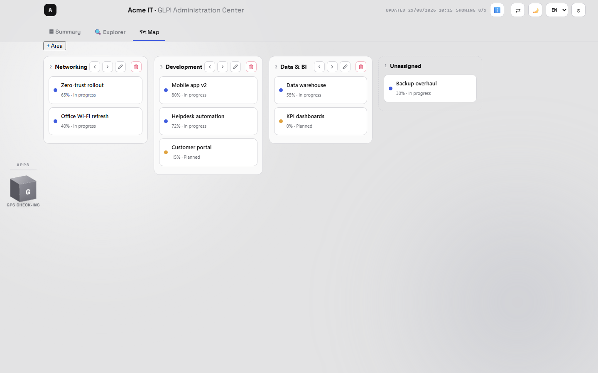
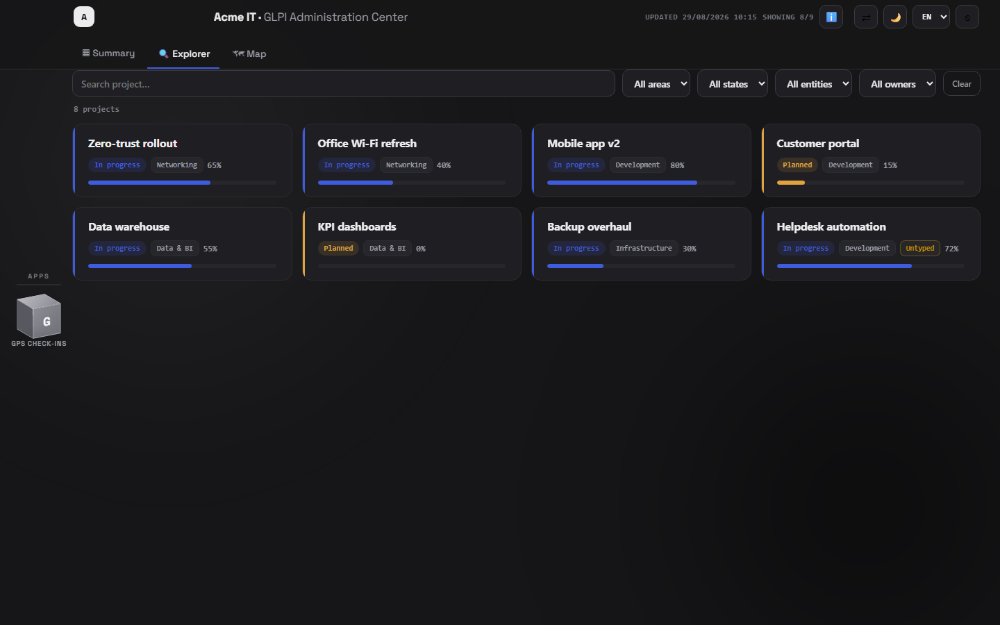
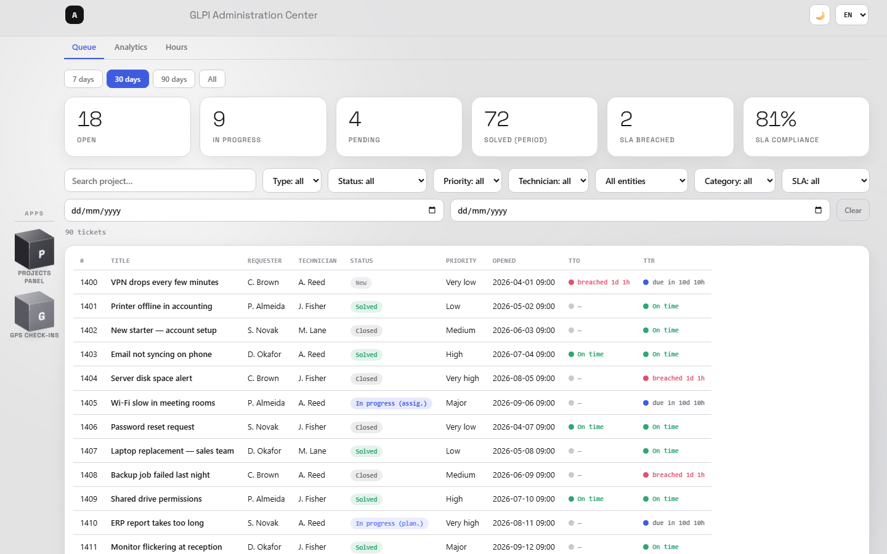
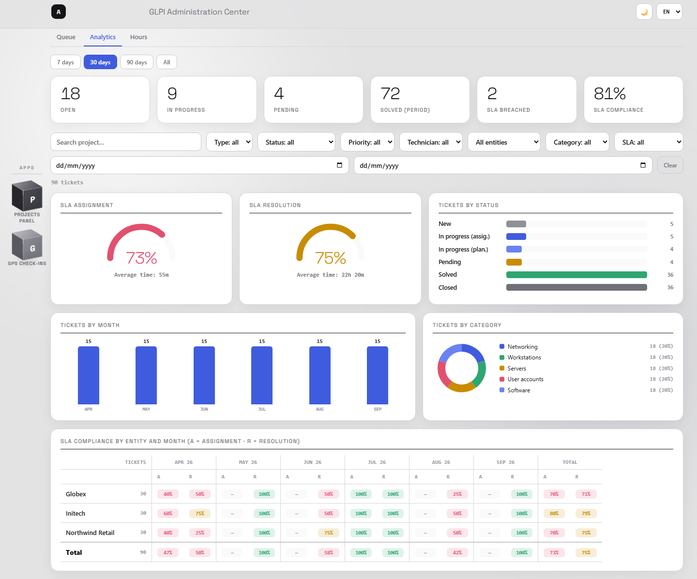
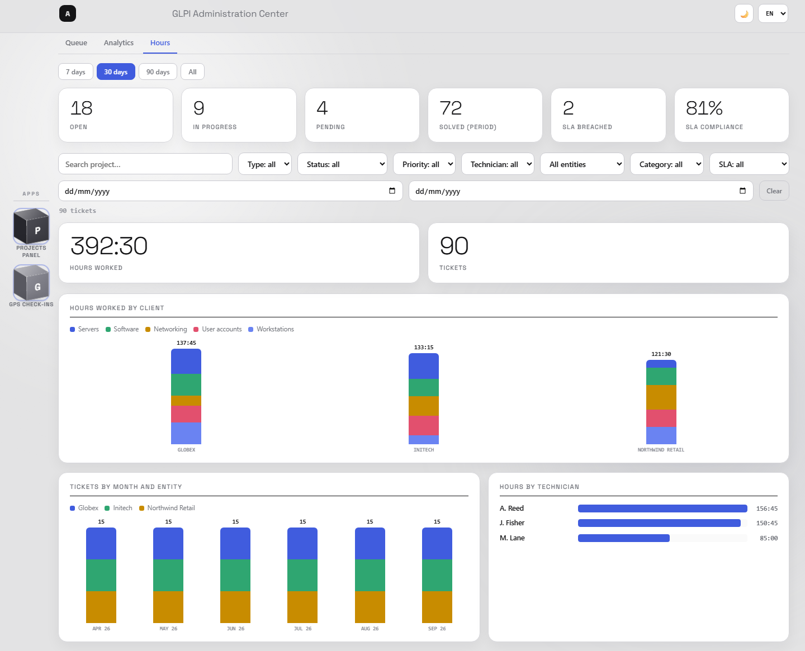
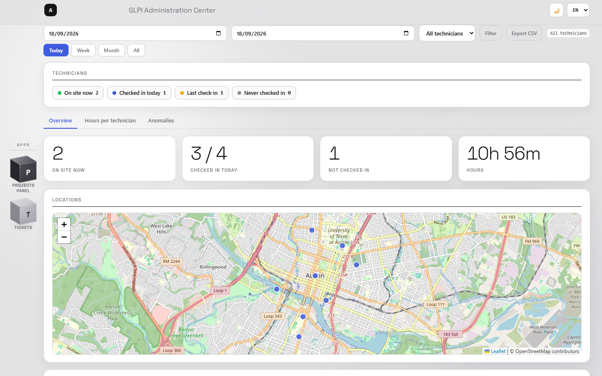
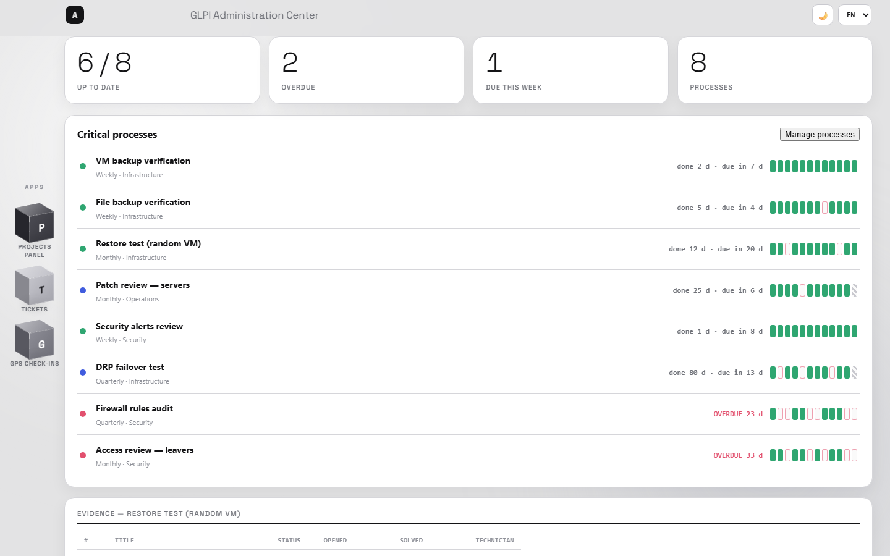
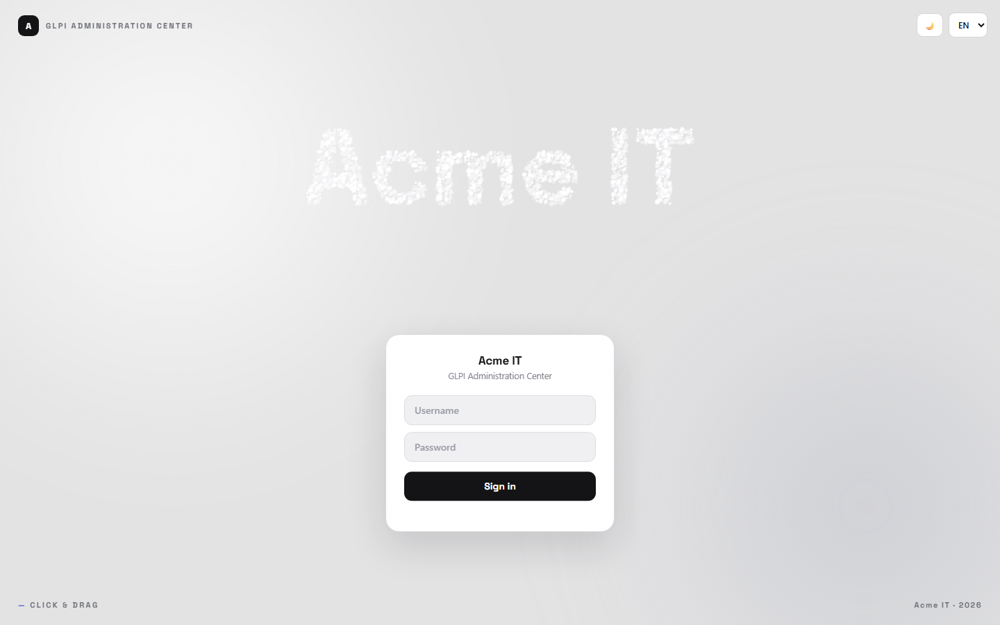

# GLPI Admin Dashboard

A lightweight, self-hosted **dashboard for GLPI Projects**. It reads your GLPI
over the **REST API** (App-Token + user token), builds a static cache, and
serves a clean, zero-dependency portal with per-project progress, tasks, a
timeline and linked knowledge-base articles.

- **Runs anywhere** — same server as GLPI or a separate host; it only needs the
  GLPI REST API over HTTPS.
- **Web setup wizard** — enter/test your connection and options in the browser;
  nothing is hardcoded, everything lives in one config file above the docroot.
- **Read-only & safe** — never writes to GLPI; users sign in with their own GLPI
  account and only see the projects GLPI grants them.
- **Configurable** — filter by project type, group by parent/entity/type, map
  your own state names (any language), custom branding.
- **Custom Map board** — group projects into your own drag-and-drop areas
  (defined in the dashboard, independent of GLPI; shared, admin-editable).
- **Tickets app** — live queue with SLA traffic lights (assignment &
  resolution deadlines), an analytics tab (SLA gauges, entity × month
  compliance matrix) and a worked-hours tab (hours by client, technician and
  month), all scoped to what each user can see in GLPI.
- **Compliance app** — a governance panel made for management meetings:
  define the critical processes that must happen every N days/weeks/months
  (backup checks, restore tests, patch reviews…) and the panel verifies them
  against **real GLPI tickets**. It doesn't check your backups — it checks
  that *somebody checked them*, with a 12-cycle history bar per process.
- **CRM app** — a commercial view for admins/supervisors: pick a **company**
  (parent entity) and see its **clients** (child entities) with contract counts,
  the nearest **renewal date** and the **commercial owner**. Reads the GLPI
  *manageentities* plugin when installed and degrades gracefully without it.
- **Two-factor authentication** — optional **TOTP** (authenticator app) with an
  **email-OTP backup** and one-time **recovery codes**, per-IP/user brute-force
  throttle, and every login event logged for a SIEM (Wazuh).
- **Multilingual** — UI in ES/EN/FR/DE/PT with a light/dark theme.
- **Modular setup** — one panel with a **General · Brand** section (name, logo, a
  separate **login brand** and **3 preset colour palettes**) plus a per-app config
  section; the panel is reached from a ⚙ gear and restricted to **Super-Admin**.
- **Optional GPS check-ins module** — field-technician presence from
  "site visit" tickets (example add-on module).

> Status: **working** — REST generator, web setup wizard, and login-gated
> portal are all in use. A Docker image is on the roadmap (see below).

> 📖 **User manual & changelog** (Spanish) — read it online at
> **<https://gps.roothard.com.ar/docDash.html>**, or in this repo under
> [`docs/`](docs/index.html): how each app works (Projects, GPS, Tickets, CRM,
> Compliance), the config panel, 2FA, compliance best practices and recommended
> GLPI categories. See also [CHANGELOG.md](CHANGELOG.md).



| Custom drag-and-drop area board | Dark theme (Explorer) |
|---|---|
|  |  |

| Tickets — live queue with SLA | Tickets — analytics |
|---|---|
|  |  |

<p align="center"></p>

<p align="center"></p>

<p align="center"></p>

<p align="center"></p>
<p align="center"><sub>The login draws <b>your company name</b> in ~2,000 interactive particles (hover scatters them; click &amp; drag swirls them).</sub></p>

---

## How it works

```
GLPI REST API ─► bin/generate.php ─► ../data-cache.json ─┐
  (your data)      (cron/CLI)         (above docroot)     │
                                                          ▼
        browser ─login─► public/login.php ─► public/data.php ─► public/index.html
       (GLPI creds)     (GLPI session)     (per-user filter)      (the board)
```

- `generate.php` pulls Projects, tasks, states, entities, users and linked
  KnowbaseItems over REST and writes **`data-cache.json`** (kept above the
  docroot). Run it from cron.
- The **front-end** is a single self-contained HTML file: an app hub, three
  project tabs (Summary / Explorer / **Map** — your custom drag-and-drop area
  board), and the optional GPS check-ins module.
- **Login-gated**: users sign in with their **own GLPI credentials**
  (`login.php`), and `data.php` returns only the projects that user can see in
  GLPI. The App-Token never leaves the server; the browser gets an HttpOnly
  session cookie.

## Requirements

- PHP 7.4+ with `curl` and `json` (CLI).
- A GLPI instance (10.x) with the **REST API enabled**
  (*Setup → General → API*), an **API client** (App-Token), and a **user API
  token** (*Preferences → Remote access keys*).

## Quick start

```bash
git clone https://github.com/RootHard/glpi-admin-dashboard.git
cd glpi-admin-dashboard
php -S localhost:8080 -t public
# 1) open http://localhost:8080/setup.php  → fill in the config panel
#    (GLPI URL + tokens, project type, branding, modules) and Save
# 2) run the generator:  php bin/generate.php   → writes ../data-cache.json
# 3) open http://localhost:8080  and sign in with your GLPI account
```

**Nothing is hardcoded.** All configuration lives in `config/settings.json`
(above the docroot) and is edited entirely through the **setup panel**
(`/setup.php`) — connection, project selection, branding (name, colour, logo,
language) and modules. On first run the panel is open; once configured it is
**Super-Admin only** and is reached from the ⚙ gear in the header (or `/setup.php`).
Secrets never reach the browser.

**Deployment layout** — only `public/` is web-served; config, `lib.php` and the
cache stay one level above it:

```
your-install/
├── config/settings.json   ← all config + secrets (chmod 600, git-ignored)
├── data-cache.json        ← generated by cron
├── lib.php
├── rh-auth.php            ← shared 2FA / throttle / audit module
└── public/                ← docroot (point your vhost here)
    ├── index.html  setup.php  config.php
    ├── login.php   logout.php  data.php   2fa.php   qrcode.min.js  (login + 2FA)
    ├── board.php   profile.php               (Map areas + profile switch)
    ├── data-cumplimiento.php  processes.php   (Compliance app)
    ├── crm.php     modules.php                (CRM app + drop-in modules)
    ├── data-tickets.php                       (Tickets app)
    ├── data-fichadas.php  license-key.php     (optional GPS module)
    └── vendor/leaflet/
```

### Keep it fresh (cron)

```cron
*/15 * * * * php /path/to/glpi-admin-dashboard/bin/generate.php >/dev/null 2>&1
```

## Configuration

Everything is edited in the **setup panel** (`/setup.php`) and stored in
`config/settings.json` (above the docroot). What you can set:

| Group | Settings |
|---|---|
| **GLPI** | URL, App-Token, user token, `tokens_in_query` (Cloudflare), profile id, TLS, same-host resolve |
| **Projects** | project type filter, group-by (`parent`/`entity`/`type`), state-name → status keywords |
| **General · Brand** | app name + logo, a **separate login brand** (name, subtitle, logo), **3 preset colour palettes** or a custom colour, default language |
| **Map board** | your own areas (create / rename / reorder / delete) + drag projects between them; shared server-side, admin-editable |
| **CRM** | on/off + cube label, and which entities are **"companies"** (their child entities become clients); empty = auto-detect entities that have children |
| **Security · 2FA** | require 2FA org-wide, per-IP/user throttle windows, email-OTP backup, SIEM (Wazuh) syslog |
| **Modules** | GPS check-ins on/off, tab label, **app website link**, its read-only DB |

Every value can also be supplied as an **environment variable** (`GLPI_URL`,
`GLPI_APP_TOKEN`, `PROJECT_TYPE`, `DB_*`, …), which overrides the file — handy
for Docker. See [`config/settings.example.json`](config/settings.example.json).

## Security

- **Hardened login** — credentials are sent to GLPI in an `Authorization: Basic`
  header, never as URL parameters, so they can't end up in web-server access
  logs. The session id is regenerated on every successful login (anti
  session-fixation, with `session.use_strict_mode`), and a per-IP throttle
  blocks brute force: 10 failed attempts → 15-minute lockout (HTTP 429).
  If your GLPI sits behind a proxy that strips the `Authorization` header,
  enable *tokens in query* in the setup panel (mind your GLPI access logs).
- **Two-factor authentication** — optional **TOTP** with a self-hosted QR, an
  **email-OTP backup** and one-time **recovery codes** (all handled by
  `rh-auth.php`; secrets stored server-side, above the docroot). 2FA can be
  enforced org-wide. Every auth event is written as JSON + a `syslog` line so a
  SIEM agent (e.g. **Wazuh**) can alert on failed / anomalous logins.
- `config/settings.json`, `lib.php` and `data-cache.json` stay **out of the
  docroot** (only `public/` is web-served); `settings.json` is git-ignored and
  written `chmod 600`.
- Secrets (tokens, DB password) never reach the browser — `config.php` exposes
  only branding + module flags.
- The board is built **per session** with each user's own GLPI rights
  (`data.php` → `GlpiClient::useSession()`); the optional cron generator is
  **read-only**. No service user token is required for the live board.
- Session cookies are `HttpOnly` + `SameSite=Lax` (+ `Secure` on HTTPS).
- `public/.htaccess` ships CSP + hardening for Apache; adapt for Nginx.

## Notes & limitations

- **Project progress** comes from each project's `percent_done` and is always
  accurate over the API.
- **Task breakdown is best-effort.** GLPI's REST API only lists *project tasks*
  whose **team includes the API user** (hardcoded in GLPI core —
  `Search::addDefaultWhere` for `ProjectTask`, with no "read all" bypass). So the
  per-project task list in the detail view shows only the tasks visible to the
  token's user. The board, progress, states, KB and dates are unaffected. If you
  need every task listed, add the API user to the relevant project teams.

## Roadmap

- [x] **Phase 1** — REST generator + login-gated portal (GLPI-credential login,
  per-user scoping, light/dark, Summary/Explorer/Map tabs with Gantt & Kanban)
- [x] **Phase 2** — web setup wizard (enter/test connection & options in the
  browser), 5-language UI (ES/EN/FR/DE/PT), profile switcher, custom Map area
  board, optional GPS check-ins module
- [x] **Apps & security** — Tickets, Compliance and **CRM** apps; **2FA**
  (TOTP + email backup + recovery codes) with SIEM logging; per-session data
  model; modular setup with brand palettes and a Super-Admin config gear
- [ ] **Phase 3** — Docker image + release tarball, CI
- [ ] **Phase 4** — extra auth modes (no-login / shared password), richer polish

## Contributing

Issues and PRs welcome. This project talks to GLPI only through its public REST
API and ships no GLPI code, so it is distributed under the permissive MIT
license.

## License

[MIT](LICENSE)
